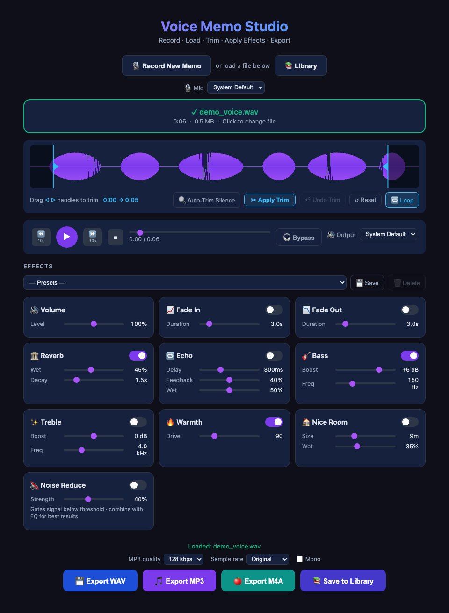

# Voice Memo Studio

A single-file, browser-based audio recorder and effects studio. Record a voice memo (or load an existing audio file), trim it, sculpt it with a rack of real-time effects, and export the result as WAV, MP3, or M4A — all client-side, with no server, build step, or install.

**[▶ Try it live](https://kevin-enyuan-li.github.io/voice-memo-studio/)** — runs immediately in your browser, no download needed.

Or grab [index.html](index.html) and open it locally — it's a single file with no build step.



## Features

### Record or load
- **Record New Memo** — captures microphone audio via `getUserMedia` / `MediaRecorder`, with echo cancellation, noise suppression, and auto-gain all disabled at the browser level (the app has its own noise gate and volume control instead). Since disabling auto-gain means the OS won't compensate for a quiet mic or distant speaker, finished recordings are automatically **peak-normalized** to a healthy, consistent loudness (boosted to ~90% of full scale) right after decoding — a no-op if the recording is already loud enough. The raw capture is also forced down to a single real channel (a `GainNode` with `channelCountMode: 'explicit'`, applying the standard 0.5·(L+R) downmix) before it ever reaches `MediaRecorder`, since some mics/headsets report 2 input channels to the OS but only actually wire the left one, which would otherwise produce a recording that's silent on one side.
- **🎚️ Input Gain** (0–300%) — a `GainNode` inserted right after the mic source, adjustable live before or during recording. It affects the level meter, Monitor, and what actually gets captured, all together, so the meter always reflects what you're about to record. Persists across sessions in `localStorage` (`vms_input_gain_v1`), separate from the effects-rack prefs/presets since it's a recording-setup control, not a mix effect.
- **Live level meter** and **elapsed-time counter** while recording.
- **Input monitoring** while recording, cycled with one button: `Off → 🎙 Direct → 🎛 Effects → Off`. Direct mode is mic → speakers with no processing for minimum latency; Effects mode routes the mic through the same effects chain used for playback, so you can hear (roughly) how the final result will sound while you talk. **Use headphones/a headset** — monitoring plays your live mic input back out immediately, so listening over open speakers will feed that output straight back into the mic and cause feedback/echo. Monitoring runs on its own dedicated low-latency `AudioContext` (`latencyHint: 'interactive'`), separate from the playback context.
- **Drag-and-drop or click-to-browse** file loading, accepting M4A, MP3, WAV, AAC, OGG, and anything else the browser's `decodeAudioData` supports.
- **Starting fresh**: successfully starting a new recording (mic permission granted) or loading a new file clears any previously loaded/recorded memo first — waveform, trim, playback position, and export buttons all reset to their empty state. Loading a file also stops an in-progress recording. Canceling the file picker or denying mic access leaves the current memo untouched.

- **Pause/Resume** recording mid-capture (native `mediaRecorder.pause()/.resume()`) — the elapsed timer freezes and excludes paused time, the rec-dot stops blinking, and the label switches to "PAUSED". The mic and live level meter stay active while paused; only the capture itself is suspended.
- **↺ Reset** recording — discards whatever's been captured so far and restarts the capture from `0:00` on the same mic stream, without re-prompting for microphone permission. Works whether you're actively recording or paused.

### Waveform & trim
- Canvas-rendered waveform (min/max peaks per pixel column, devicePixelRatio-aware).
- Drag the two triangular handles directly on the waveform to set trim start/end; excluded regions are dimmed.
- Click anywhere on the waveform to seek.
- **Apply Trim** cuts the buffer to the selected range; **↩ Undo Trim** restores the buffer from right before the last Apply (single-level undo). **↺ Reset** just resets the handles back to the full range without cutting anything.
- **🔍 Auto-Trim Silence** scans ~20ms RMS-energy frames (relative to the clip's own peak, so it adapts to quiet vs. loud recordings) to snap the trim handles to the first/last non-silent audio, with a little padding on each side. It only *sets the selection* — review it, then Apply Trim as usual. Shows an error instead of guessing if the whole clip looks like silence.
- **Exports always use the current trim selection**, even if you never click Apply Trim — `getExportBuffer()` slices a non-destructive copy of the current selection for WAV/MP3/M4A rendering.
- **🔁 Loop** plays back only the current trim selection, repeating natively via `AudioBufferSourceNode.loop`/`loopStart`/`loopEnd` — no manual rescheduling. Dragging the trim handles while looping retunes the loop live.

### Playback
- Play/pause, stop, ±10s skip, and a seek bar synced to a canvas playhead cursor.
- **Keyboard shortcuts** (ignored while a form control has focus, or a modifier key is held): `Space` play/pause, `←`/`→` skip ∓5s, `Home` seek to start.
- **🎧 Bypass** toggles an instant A/B compare — forces every effect off and volume to unity so you can hear the dry source vs. the fully-processed version without touching any sliders. It only affects live playback; **export always renders the fully-effected audio regardless of Bypass**, since export reads `getParams()` directly rather than the bypass-aware params used for playback.
- Effect parameter changes apply live to a playing buffer (most are patched in-place on the Web Audio graph; a few — fade in/out duration/toggle, Nice Room size, noise-gate on/off, Bypass, Loop — require restarting playback from the current position since they can't be changed on a live node). Every such restart properly disconnects the previous 13-node effects chain (`teardownChain()`) before building a fresh one — without it, repeated restarts (toggling Loop/Bypass, dragging sliders, plain play/pause cycles) would leak nodes and their `ConvolverNode` impulse-response buffers indefinitely, which is invisible on desktop's large memory budget but can crash the tab on mobile after enough restarts in one session.

### Effects rack
All effects are built from native Web Audio nodes and can be toggled and tweaked independently:

| Effect | Controls | Implementation |
|---|---|---|
| 🔊 Volume | Level (0–200%) | Input `GainNode` |
| 📈 Fade In | Duration | Scheduled linear ramp on the master gain (shares one automation schedule with Fade Out so they don't clobber each other) |
| 📉 Fade Out | Duration | Scheduled linear ramp on the master gain |
| 🏛️ Reverb | Wet, Decay | `ConvolverNode` fed a generated white-noise decay impulse response |
| 🔁 Echo | Delay, Feedback, Wet | `DelayNode` with feedback loop |
| 🎸 Bass | Boost (dB), Freq | Lowshelf `BiquadFilterNode` |
| ✨ Treble | Boost (dB), Freq | Highshelf `BiquadFilterNode` |
| 🔥 Warmth | Drive | `WaveShaperNode` with a generated soft-clip distortion curve |
| 🏠 Nice Room | Size, Wet | `ConvolverNode` fed a custom-synthesized impulse response with multi-tap early reflections + a diffuse tail, scaled by room size |
| 🔇 Noise Reduce | Strength | A custom `AudioWorkletProcessor` ("noise-gate") that gates the signal below an envelope-following threshold |

Effect settings auto-persist across sessions in `localStorage` (`vms_prefs_v1`). On top of that, **named presets** let you save/recall multiple full effect-rack configurations: the dropdown + Save/Delete buttons above the effects grid read/write a separate `vms_presets_v1` key, so you can keep e.g. a "Podcast" and a "Phone call" preset side by side without overwriting each other. Selecting a preset also becomes the new auto-saved "last used" settings.

### Export
Exports run the full effects chain through an `OfflineAudioContext` for fast, non-realtime rendering, then encode:
- **WAV** — hand-rolled PCM16 encoder, no dependencies.
- **MP3** — via [lamejs](https://cdnjs.cloudflare.com/ajax/libs/lamejs/1.2.1/lame.min.js), loaded from a CDN `<script>` tag, at a selectable bitrate (96/128/192/320 kbps). Requires network access; falls back with an error message if unavailable.
- **M4A** — since there's no pure-JS AAC encoder in play, this re-plays the offline-rendered buffer in real time through a `MediaStreamDestination` and captures it with `MediaRecorder` (`audio/mp4;codecs=mp4a.40.2`), so encoding takes as long as the clip's duration. Falls back with an error if the browser doesn't support MP4/AAC recording (e.g. Firefox).

**Export options** (above the export buttons) apply to all three formats: MP3 bitrate, an output **sample rate** (Original/44.1k/22.05k/16k — Web Audio resamples automatically inside the `OfflineAudioContext`), and a **mono downmix** checkbox (renders through a single-channel `OfflineAudioContext`, which downmixes stereo per the Web Audio spec's standard channel-mixing rules).

Exported files are named `<original-basename>_studio.<ext>` (or `recording_<timestamp>_studio.<ext>` for fresh recordings).

### Saved memo library
- **📚 Library** (next to Record New Memo) opens a panel listing memos saved locally in **IndexedDB** (`vms_library_v1`), persisting across page reloads — name, duration, and saved date, with **▶ Load** and **🗑 Delete** (confirms before deleting) per row.
- **📚 Save to Library** (in the export row) WAV-encodes the *current* `audioBuffer` — so any trim you've applied is reflected — and stores it as a new library entry. It does not include the live effects rack (that's what the format exports are for); think of the library as source-material checkpoints, not final renders.
- Loading a memo from the library reuses the same decode path as dragging in a file (`decodeAndLoad()`), including the usual "start fresh" reset of the current session first.

## Tech stack

- Plain HTML/CSS/JS — no framework, no bundler, no `npm install`.
- **Web Audio API**: `AudioContext`, `OfflineAudioContext`, `ConvolverNode`, `BiquadFilterNode`, `DelayNode`, `WaveShaperNode`, `AudioWorkletNode`.
- **MediaRecorder API** for microphone capture, pause/resume, and M4A export.
- **Canvas 2D** for waveform rendering.
- **IndexedDB** for the saved-memo library; **localStorage** for effect prefs/presets.
- One external dependency, loaded via CDN: [lamejs](https://cdnjs.cloudflare.com/ajax/libs/lamejs/1.2.1/lame.min.js) for MP3 encoding.

## Project structure

```
voice-memo-studio/
├── index.html                       # Entire app: markup, styles, and JS in one file
└── voice-memo-studio.code-workspace # VS Code workspace file
```

## Running it

No build or server required — just open `index.html` in a browser:

```bash
open index.html
```

Some browsers restrict microphone access (`getUserMedia`) and `AudioWorklet` on the `file://` origin. If recording or noise reduction doesn't work when opened directly, serve the folder locally instead, e.g.:

```bash
npx serve .
# or
python3 -m http.server 8000
```

then visit `http://localhost:...` in your browser.

## Browser support notes

- Recording, effects, and WAV/MP3 export work in any modern Chromium/WebKit/Firefox browser with Web Audio + MediaRecorder support.
- **AudioWorklet** (used for Noise Reduce) requires a secure context (`https://` or `localhost`) — it won't load over plain `file://` or `http://` in some browsers.
- **M4A export** depends on the browser supporting `audio/mp4` recording in `MediaRecorder` (works in Chrome/Edge/Safari; not supported in Firefox as of this writing) — the app detects this and shows an error with a suggestion to use WAV/MP3 instead.
- MP3 export requires internet access to load lamejs from the CDN on first use.
- The **saved memo library** is IndexedDB scoped to the page's origin — memos saved when serving over `http://localhost:8000` won't show up when opened via `file://`, and vice versa. Use one consistent way of opening the app if you want the library to persist.
- **iOS Safari** needs a real, non-empty `<audio>` element played (and immediately paused) synchronously within a user tap to reliably claim the correct "media playback" audio session — otherwise Web Audio API output can end up silent with no error at all. The app does this on every Play tap and at the start of recording (see `unlockAudioSession()`); if you're still not hearing anything on iOS after that, check Control Center's audio output route first (audio silently routing to a disconnected/out-of-range Bluetooth device is by far the most common cause) before assuming it's a bug.
